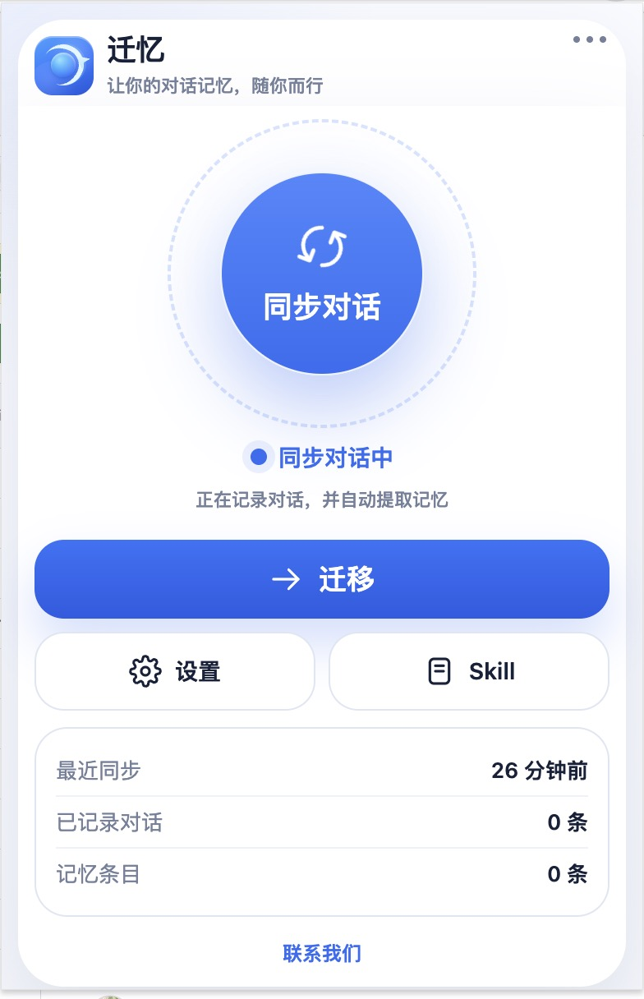
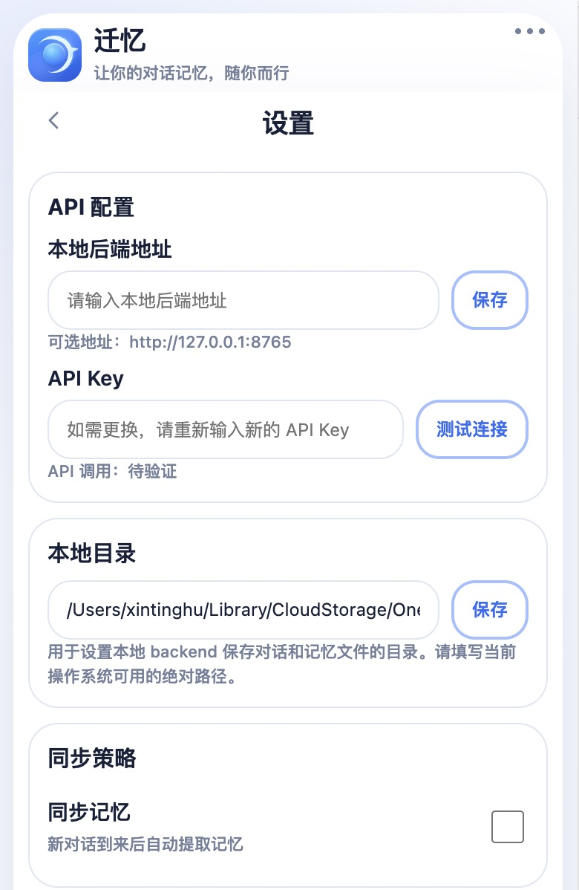
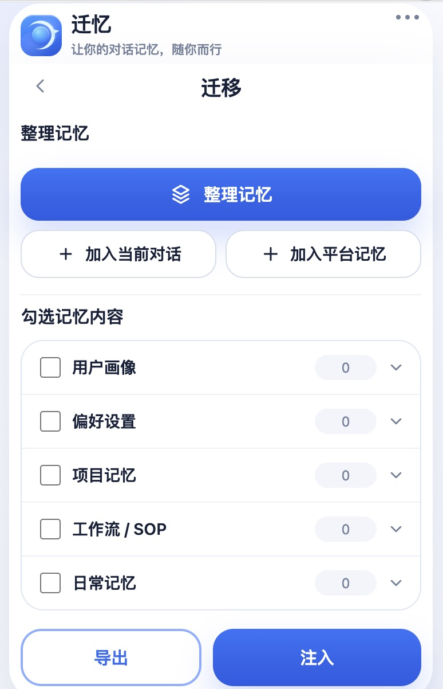

<p align="center">
  
</p>

<p align="center">
  <strong>Contributors:</strong> 许锡楠、王浩然、胡心亭
</p>

<p align="center">
  <a href="README_en.md">English</a>
</p>

QMem 是一个面向 AI 对话的浏览器扩展程序。它可以把你在 ChatGPT、Gemini、DeepSeek、豆包等平台上的对话保存到本地，整理成可查看、可勾选、可删除、可导出、可注入到新会话里的长期记忆。

<p align="center">
  <a href="#quickstart">Quickstart</a> ·
  <a href="#页面功能">页面功能</a> ·
  <a href="#本地记忆">本地记忆</a> ·
  <a href="#仓库结构">仓库结构</a>
</p>

<br>

## 界面预览

<table>
  <tr>
    <td width="33%"></td>
    <td width="33%"></td>
    <td width="33%"></td>
  </tr>
  <tr>
    <td align="center">主页面</td>
    <td align="center">设置页</td>
    <td align="center">迁移页</td>
  </tr>
</table>

<br>

## Quickstart

### 1. 加载扩展

1. 下载本仓库源码，或下载 ZIP 后解压。
2. 打开浏览器扩展管理页。
   - Chrome / Arc / Brave：`chrome://extensions/`
   - Edge：`edge://extensions/`
3. 打开“开发者模式”。
4. 点击“加载已解压的扩展程序”。
5. 选择仓库根目录 `QMem/`。

加载成功后，浏览器工具栏里会出现 QMem 扩展图标。

### 2. 启动本地后端

首次使用时，在仓库根目录安装依赖：

```bash
pip install -r backend_service/requirements.txt
```

使用时启动本地后端：

```bash
uvicorn backend_service.app:app --host 127.0.0.1 --port 8765 --reload
```

### 3. 配置设置页

打开扩展的“设置”页，填写：

- `本地后端地址`：推荐 `http://127.0.0.1:8765`
- `API Key`：用于整理记忆和自动提取记忆；只记录对话时可以先不配置
- `本地目录`：可留空使用默认目录，也可以填写一个长期保留的绝对路径

然后点击“保存”和“测试连接”。

当前后端默认使用 OpenAI-compatible 接口：

- `api_provider = openai_compat`
- `api_base_url = https://api.deepseek.com/v1`
- `api_model = deepseek-chat`

### 4. 同步、整理和迁移

1. 在主页面点击“同步对话”。
2. 按需在设置页打开“同步记忆”。
3. 继续在支持的平台聊天，或在迁移页点击“加入当前对话”“加入平台记忆”。
4. 进入“迁移”页，点击“整理记忆”。
5. 勾选需要的记忆，点击“导出”或“注入”。

<br>

## 页面功能

### 主页面

- `同步对话`：开启或暂停当前平台的对话采集。开启后，QMem 会持续把新的 user / assistant 轮次保存到本地 raw 层。
- `迁移`：进入记忆迁移工作台。在这里可以加入当前对话、加入平台记忆、整理记忆、勾选记忆，并执行导出或注入。
- `设置`：进入本地配置页，用来填写后端地址、API Key、本地目录，并管理同步、注入和数据清理选项。
- `Skill`：进入 Skill 管理页，用来查看已保存 Skill、浏览推荐 Skill，并把 Skill 导出或注入到当前会话。

### 设置页

- `本地后端地址`：填写本机 FastAPI 后端地址，通常是 `http://127.0.0.1:8765`。扩展会通过这个地址读写本地记忆和调用整理接口。
- `API Key`：填写模型服务密钥，用于整理记忆、生成结构化节点和前端展示文案；只记录 raw 对话时不需要。
- `测试连接`：检查本地后端和模型 API 是否可用，适合在首次配置或更换 key 后使用。
- `本地目录`：设置 raw 对话、episodes、长期记忆和 metadata 的保存目录。留空时使用默认目录；自定义时请填写绝对路径。
- `导入对话`：导入 `json`、`jsonl`、`md`、`txt` 历史对话文件，把旧聊天补进本地 raw 层。
- `同步记忆`：开启后，新同步到本地的对话会自动触发增量记忆维护；关闭后，可以之后手动点击“整理记忆”。
- `详细注入`：控制迁移页点击“注入”时是否额外带上相关 raw turns。关闭时只注入结构化记忆和 episode summary，打开时会带更多原始上下文。
- `清理所有记忆`：删除已保存的 raw 对话和结构化记忆，但保留当前设置。
- `清理缓存`：清理临时缓存，保留主要记忆文件。

### 迁移页

- `加入当前对话`：把当前标签页里的 AI 对话保存到本地 raw 记忆。适合临时把正在看的会话补进 QMem。
- `加入平台记忆`：让当前 AI 平台汇报它已经保存的 saved memory、custom instructions、agent config 和 platform skills，并保存为平台记忆快照。
- `整理记忆`：从 raw 对话和平台记忆中重建结构化长期记忆，包括用户画像、偏好设置、项目记忆、工作流、日常记忆和 Skill。
- `导出`：把当前勾选的记忆生成可迁移的记忆包。这个包可用于备份、复制到其他设备，或迁移到其他 AI 平台。
- `注入`：把当前勾选的记忆写入当前 AI 会话。普通注入会包含结构化记忆节点和相关 episode summary，不默认注入大段 raw 对话；如果在设置页打开“详细注入”，会额外注入相关 raw turns，用于需要完整上下文的场景。

### Skill 页面

- `我的 Skill`：查看已经保存到本地的 Skill。
- `为你推荐`：查看后端根据当前记忆和推荐目录提供的 Skill。
- `加入我的 Skill`：把勾选的推荐 Skill 保存到“我的 Skill”，后续可继续导出或注入。
- `导出`：导出勾选的 Skill，方便备份或迁移。
- `注入当前会话`：把勾选的 Skill 写入当前 AI 会话，让当前对话临时获得对应能力说明。

<br>

## 本地记忆

默认记忆目录：

```text
backend_service/wiki/
```

设置页的“本地目录”可以留空。留空时使用上面的默认目录；如果自定义目录，请填写当前操作系统可用的绝对路径。

QMem 使用分层记忆：

- `raw/`：原始对话，保留网页采集或文件导入的聊天内容。
- `platform_memory/`：平台侧已经保存或生成的记忆信号。
- `episodes/`：从 raw 对话中提取的对话级记忆单元。
- `profile/`：用户画像，例如身份、知识背景、长期关注方向。
- `preferences/`：偏好设置，例如语言偏好、表达风格、格式约束、主要任务类型。
- `projects/`：项目记忆，例如长期项目、当前阶段、目标、上下文和状态。
- `workflows/`：工作流 / SOP，例如用户反复使用的方法、流程和协作习惯。
- `daily_notes/`：日常记忆，例如生活偏好、选择习惯、非项目类上下文。
- `skills/`：用户保存或推荐的 Skill 资产。
- `metadata/`：索引、整理状态、展示文案和删除 / 忽略记录。

删除不想保留的条目后，QMem 会记录 ignore / lock，避免下次整理时把同一条记忆又自动生成回来。

<br>

## 仓库结构

- `popup/`：扩展弹窗页面。
- `content/`：页面侧采集与注入逻辑。
- `background/`：扩展后台逻辑和增量同步。
- `backend_service/`：本地 FastAPI 后端与推荐 Skill 目录。
- `prompts/`：运行时 prompt。
- `memory_transferor/`：Python 记忆流水线、存储模型、策略和导出工具。
